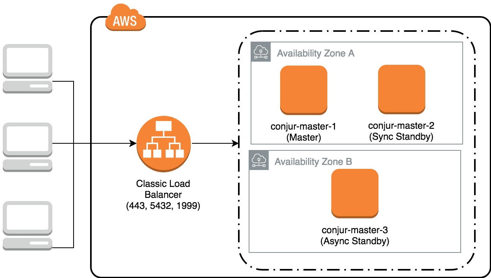

# Conjur HA in AWS

## Introduction
This project demonstrates deploying and managing a HA Conjur cluster in AWS.
The architecture for this deployment is as follows:



### Load Balancer

This demo uses an AWS Classic Load Balancer (LB) as the ingress point for
connections to the master cluster. The LB is responsible for performing
health checks against the three nodes to determine which one is active
and should receive traffic.

The LB forwards three TCP ports to the active master cluster node:

- 443: HTTPS traffic for API and UI interactions
- 5432: Follower data replication from the Master
- 1999: Follower audit log forward to the Master

The LB is configured to expect a `200` HTTP response status code from a node's `/health` endpoint to be considered healthy. Standbys return a `502` status code, and will be considered unhealthy by the load balancer, preventing traffic from being directed to them.

### EC2 Master Instances

The master cluster nodes are all EC2 instances running the Conjur EE
AMI image. This demo uses `m4.large` instance types and the security groups
allow inbound connects on ports:

- 443: HTTPS traffic
- 5432: Postgres traffic for follower replication
- 1999: Syslog traffic for follower audit log forwarding
- 22: SSH traffic for system administration

## Prerequisites

This demo requires the following tools to:

- Docker
- Docker Compose
- Terraform
- AWS CLI

## Deployment

To initially install the cluster:

1. Create a file in the project directory called `terraform.tfvars` and
   configure the AWS environment for the deployment:
    ```sh
    # (OPTIONAL) Arbitrary prefix to add to each resource name
    resource_prefix = ""

    # (REQUIRED) VPC to provision Load Balancer and Nodes into
    vpc_id = ""

    # (REQUIRED) AMI to use for Conjur Master nodes
    ami_id = ""

    # (REQUIRED) Name of SSH key pair to attach to Conjur Master nodes
    key_name = ""

    # (OPTIONAL) Names of availability zones to use for nodes, 
    # defaults to the value below
    availability_zones = ["us-east-1a", "us-east-1b"]
    ```

2. Provision the AWS resources:
    The terraform scripts assumes you will set the AWS connection credentials as environment variables as below:
    ```sh
    $ export AWS_ACCESS_KEY_ID="anaccesskey"
    $ export AWS_SECRET_ACCESS_KEY="asecretkey"
    $ export AWS_DEFAULT_REGION="us-west-2"
     ```
    ```sh-session
    $ ./0_terraform_aws
    ...
    ```
   

2. Generate certificates for the Cluster
    > TBD, for now the cluster will use self-generated certificates

3. Initialize the Conjur Cluster
    > This script requires you to first set the environment variable `SSH_KEY_FILE`.
    > The value of this variable should be the path to the SSH private key to connect
    > to the EC2 nodes. e.g. `/user/conjur/.ssh/id_rsa`
    ```sh-session
    $ ./1_init_cluster
    ...
    Waiting for master cluster...
    Successful Health Checks: 0
    ...
    Successful Health Checks: 8
    Successful Health Checks: 9
    Successful Health Checks: 10
    ```

4. (Optional) Deploy Followers in AWS
    To also configure followers with the cluster, run the command:
    ```
    $ ./1.1_init_followers
    ```


## HA Scenarios

This demo environment allows to walk through 3 HA management scenarios with Conjur

### Auto-Failover

1. Kill the Master Node
    > **NOTE:** This script ends when the auto-failover to a new active node is complete.
    ```sh-session
    $ ./2_kill_active_master
    Killing node 1 (ec2-3-93-33-221.compute-1.amazonaws.com)...
    Waiting for auto-failover...
    Waiting for master cluster...
    Successful Health Checks: 0
    ...
    Successful Health Checks: 8
    Successful Health Checks: 9
    Successful Health Checks: 10
    ```

### Failed Node Re-Enrollment

1. Clean State on Failed Instance
   ```sh-session
   $ ./3_reenroll_failed_master
   Recreating Conjur appliance container on failed host...
   ...
   Configuring new appliance as standby...
   ...
   Enrolling the new standby into the existing master cluster...
   ...
   Waiting for master cluster...
   ...
   Successful Health Checks: 10
   ```

### Reboot Entire Cluster

> **NOTE:** This was previously done entirely manually using the AWS EC2 Console

1. Stop All Instances
    > TBD

2. Start Active Master
    > TBD

3. Start Standbys
    > TBD

## Cleanup

1. Clean up the AWS resources
    ```sh-session
    $ ./100_cleanup_aws
    ...
    ```

## Utility Tools

There are a few additional scripts available in `bin/util` to make inspecting
the system state easier.

- **follow_node_logs**
    Connects to a master node and streams the Conjur logs from the appliance on that node.
    ```sh-session
    $ bin/util/follow_node_logs {node_id} # Where `node_id` is `1`, `2`, or `3`
    ```

- **kill_node**
    Connects to a master node and kills the Conjur appliance running on it
    ```sh-session
    $ bin/util/kill_node {node_id} # Where `node_id` is `1`, `2`, or `3`
    ```

- **recreate_cluster**
    Destroys and recreates all of the EC2 instances running the Conjur cluster
    > **NOTE:** This is a destructive operation and requires rebuilding the Conjur cluster from scratch
    ```sh-session
    $ bin/util/recreate_cluster
    ```

- **reenroll_node**
    Rebuilds an appliance node as a standby and enrolls it into the Conjur master cluster
    ```sh-session
    $ bin/util/reenroll_node {standby_node_id} {master_node_id} # Where `node_id` is `1`, `2`, or `3`
    ```

- **refresh_aws_state**
    Refreshes the local state of the AWS resources
    > **NOTE:** This allows the scripts to operate correctly after making changes (e.g. restarting)
    > in the AWS web consol
    ```
    $ bin/util/refresh_aws_state
    ```

- **ssh_node**
    Connects to a master node and begins a shell session on it
    ```sh-session
    $ bin/util/ssh_node {node_id} # Where `node_id` is `1`, `2`, or `3`
    ```

- **wait_for_master**
    Blocks the current shell session until the Conjur cluster is healthy
    ```sh-session
    $ bin/util/wait_for_master
    ```
- **watch_cluster_health**
    Reports the health status of the Conjur cluster through the load balancer
    ```sh-session
    $ bin/util/watch_cluster_health
    ```
- **watch_node_health**
    Reports the health status for a particular node of the Conjur cluster
    ```sh-session
    $ bin/util/watch_node_health # Where `node_id` is `1`, `2`, or `3`
    ```
