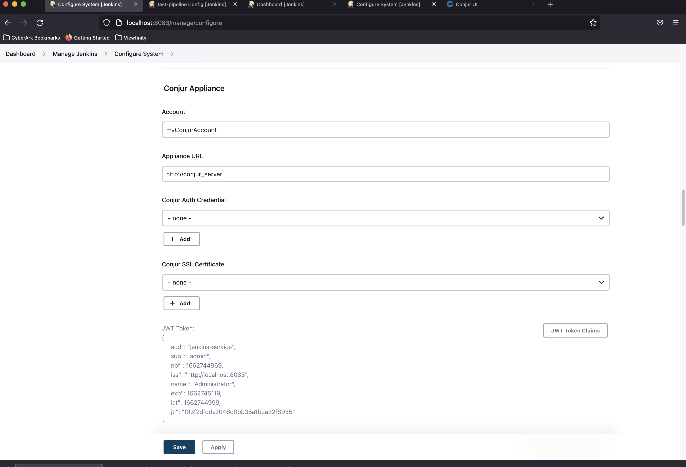
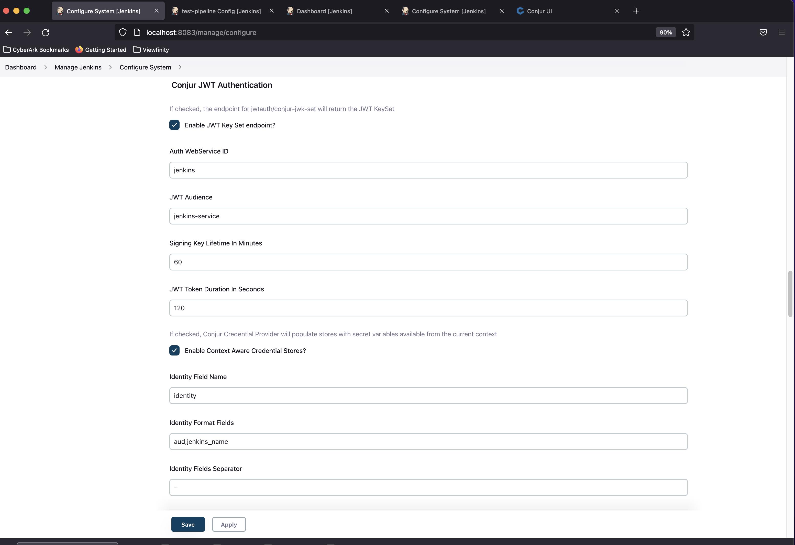
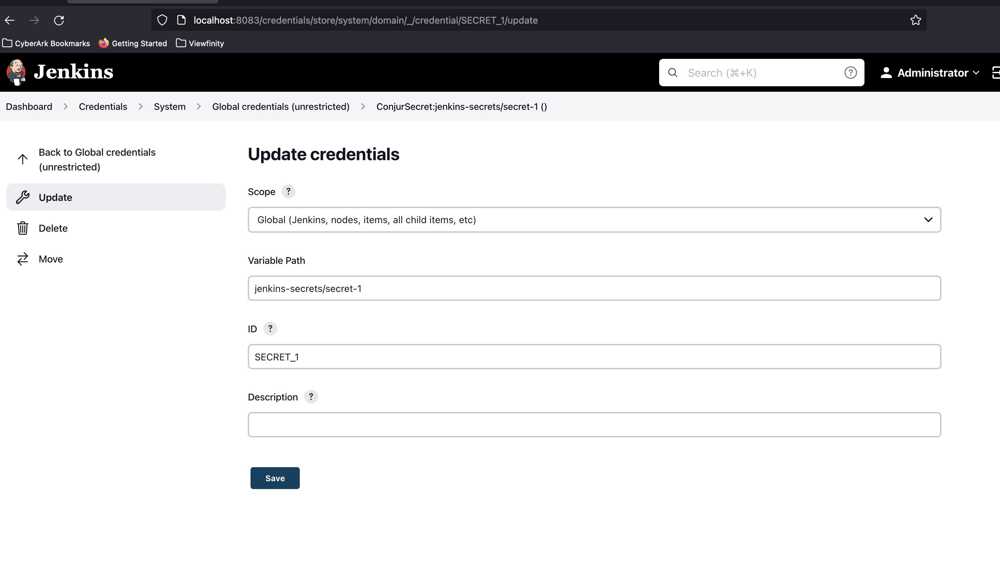

# Setup Conjur Jenkins Credential Plugin with Authn-JWT

## Jenkins

### Conjur Appliance Setup



### Conjur JWT Authentication



### Credential Setup



### Pipeline

Create a pipeline called `test-pipeline` with the following definition:

```
node {
   stage('Work') {
      withCredentials([conjurSecretCredential(credentialsId: 'SECRET_1', variable: 'SECRET')]) {
         echo "Hello World $SECRET"
      }
   }
   stage('Results') {
      echo 'Finished!'
   }
}
```

## Conjur

### Commands

The following need to be run from inside the CLI, using the API key displayed when runnng `./start`.

```sh
# Load Authenticator
conjur policy load root /policy/authn-jwt-jenkins.yml

conjur variable values add conjur/authn-jwt/jenkins/jwks-uri 'http://jenkins_server:8080/jwtauth/conjur-jwk-set'

conjur variable values add conjur/authn-jwt/jenkins/issuer 'http://localhost:8083'

conjur variable values add conjur/authn-jwt/jenkins/audience 'jenkins-service'

conjur variable values add conjur/authn-jwt/jenkins/token-app-property 'jenkins_name'

conjur policy load root /policy/jenkins-projects.yml

conjur variable values add conjur/authn-jwt/jenkins/identity-path 'jenkins/projects'

# Load jenkins specific secrets and set values:
conjur policy load root /policy/jenkins-secrets.yml

conjur variable values add jenkins-secrets/secret-1 'foo'

conjur variable values add jenkins-secrets/secret-2 'bar'
```
