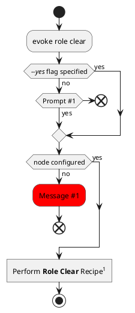
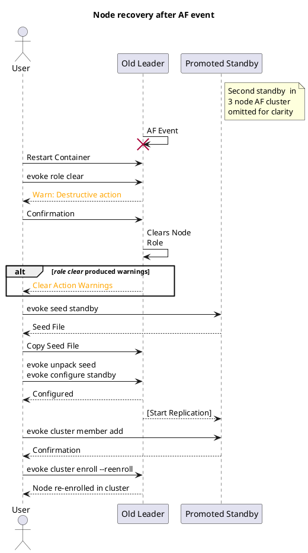

* Can break work into happy path and edge cases for implementation in order to reduce overall ticket size (shoot for 2-3 SP)

## Micah Questions
* Can/Should we open up an API endpoint for performing the actual work involved in the clear?
* 

## Open questions?

* Do we want to error out on any step in the clearing process?
  * Failing to stop a service doesn't mean that the reset won't work, but it does mean that the container might still be in a failing state after the operation.
  * *Possible* solution is to collect any errors along the way and then print a warning at the end of operation telling the user what we were unable to do.
* Should we limit what nodes you can run the command on?

## User Flows

* Using `evoke role clear` on failed leader after AF event
  * Should include full flow of what a user will have to do on the failed leader to go from dead to fully re-deployed as a standby
  * Sequence diagram maybe? (because it will include multiple nodes and user interaction)
* Activity diagram for actually using the CLI including pre-flight checks for the command
  * Should we include a prompt/yes command for the CLI
  * Should we limit the node roles it can be run on? (technically would work on any type of node)
* Activity diagram listing actual steps for resetting the cluster (possibly just tie into last diagram as well)

## Steps:
* Run the `Evoke::Action::Cluster::Clear` action if this is an AF node
* Stop required services:
  * (possible partial list): **conjur**, **nginx**, **seed**, **health**, **info**, **usage**, **selective-replication-leader**, **pg/main**, **pg/audit**
* Disable services normally disabled at startup:
  * (again partial list): **conjur**, **nginx**, **selective-replication-leader**, **pg/audit**, **pg/main** (not standard **pg** service)
* Stop **AND** drop the database clusters
* Re-create the *main* datbase cluster (audit will be created through configuration)
* Update the *main* clusters configurations to match the Appliance defaults
* Remove Appliance configuration files (including node role)
* Startup default appliance services
  * **health**, **info**, **usage**


### CLI Usage



### Role Clear Recipe Flow

```plantuml
hide empty description
start
if (HA Enabled?) then (yes)
  ://evoke cluster clear --force//;
else (no)
endif

:Stop all //Conjur// services;
note right
Done to close DB connections
so we can reset it cleanly
end note

:Disable services;
note left
* conjur
* conjur/rotation
* nginx
* pg/audit
* pg/wait
* syslog-forwarder
end note

group Reset Database
  if (Audit Exists?) then (yes)
    ://pg_ctlcluster 15 audit stop//;
    ://pg_dropcluster 15 audit//;
  else (no)
  endif
  ://pg_ctlcluster 15 main stop//;
  ://pg_dropcluster 15 main//;

  :pg_createcluster 15 main;
  :template '/etc/postgresql/<version>/main/postgresql.conf';

  note right
    Restores Appliance default PG 
    config file from CINC template
  end note

  :template '/etc/postgresql/<version>/main/pg_hba.conf';
  ://echo -n "manual" > /etc/postgresql/<version>/main/start.conf//;
end group

:rm ///etc/cinc/solo.json//;
:rm ///opt/conjur/etc/role//;

:Restart health/info/usage services;
stop
```


### Full user reset after Failover event

